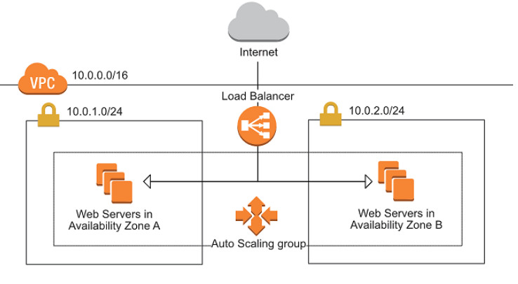
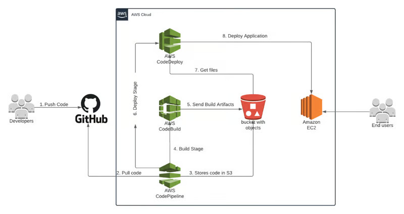

# Projeto COODESH

Este projeto é um teste para admissão.
O teste consiste em montar um ambiente utilizando IAC para criar a rede, as subnets, o Aplication Load Balance, o Auto Scaling, o Target Group e o template para subir o EC2 com a aplicação, que é um site com apenas um html. 




A outra parte do teste consiste em utilizar o AWS Pipeline para realizar a atualização da aplicação, a cada vez que for feito um commit no branch main. 
Quando for realizado um push no branch main do projeto do Github, o AWS Pipeline vai iniciar a build da aplicação, gerando uma imagem nova atualizada e criando um novo template e a aplicando o deploy atualizando as instancias EC2.




## Descrição das tecnologias

Para realizar a construção da estrutura utilizando IAC e a utilização de CI/CD foram utilizadas as seguintes tectnologias:

* **Terraform** - é uma ferramenta de infraestrutura como código que permite definir, configurar e provisionar recursos de infraestrutura de forma declarativa. Ele automatiza a implantação e gerenciamento de recursos em vários provedores de nuvem e ambientes locais.
* **AWS** - oferece uma vasta gama de serviços de computação em nuvem com escalabilidade, confiabilidade e segurança. Sua presença global garante baixa latência e alta disponibilidade, tornando-a uma escolha ideal para empresas que buscam inovação e eficiência na nuvem.
* **GitHub** - é uma plataforma de hospedagem de código-fonte que permite que desenvolvedores colaborem em projetos de software usando controle de versão Git. Ele oferece recursos como controle de acesso, rastreamento de problemas, integração contínua e hospedagem de páginas da web, facilitando o desenvolvimento colaborativo e o compartilhamento de código entre equipes.


## Instalando Ambiente

Siga as instruções abaixo para baixar os códigos dos repositórios e criar os artefatos na AWS.


### Github

Instale o github seguindo as instruições: https://docs.github.com/pt/apps/using-github-apps/installing-your-own-github-app

Depois de instalado baixe o repositório na sua máquina:
```
git clone https://github.com/zedmaster/coodesh.git
```


### Terraform

Para instalar o Terraform utilize as instruções do site oficial: https://developer.hashicorp.com/terraform/tutorials/aws-get-started/install-cli


Depois de instalado o Terraform, entre na pasta terraform do projeto baixado e digite:
```
terraform init
```

Com as variáveis de ambiente da AWS configuradas, teste a conexão:
```
terraform plan
```

Caso tudo ocorra bem, para criar os artefatos digite:
```
terraform apply -auto-approve 
```


